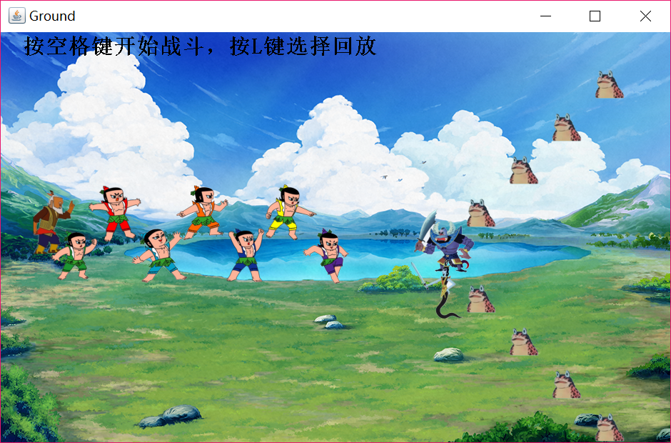
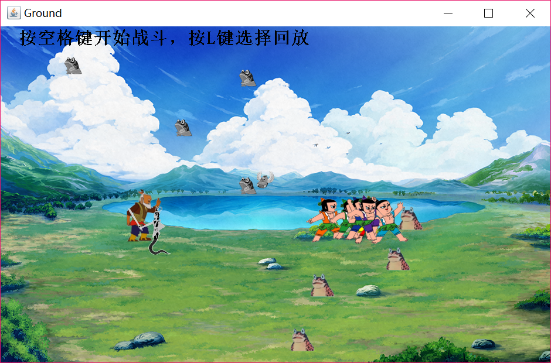

# 葫芦娃大战妖精

**郭雨琦 151220035**


## 实现效果

1. 按下`空格键`之后，正方按`鹤翼`阵型出发；反方以`长蛇`阵型出发；
2. 打斗开始前或者打斗结束后按下`L`可实现读取文件并回放；
3. 回放和打斗过程中按下`P`可暂停；
4. 游戏目标：击败所有敌人


## 游戏界面

进入游戏后界面如下



按下`空格键`后，正方按`冲轭阵`出发；反方以`鹤翼阵`出发



战斗开始前或结束后，可以按‘L’打开文件夹，选择存档，重现场景


## 战斗设定

* 葫芦娃的奔跑速度是其他所有生物的两倍。

* 当正反双方相遇时，由上帝决定双方的生死，正方有八成的概率获胜。


## 精彩的战斗

在save文件夹中，存放了几次精彩的战斗场景。


## 封装与继承

抽象类*Creatures*实现了`Runnable`接口，有两个抽象子类*Good*和*Bad*，*Good*有子类**Grandpa**和**GourdDolls**，分别代表爷爷和葫芦娃；*Bad*有子类**ScorpionKing**、**SnakeQueen**和**Toad**，分别代表蝎子大王、蛇精和蝎子精（小马仔）。


## 多态

`Ground`类中的3个`ArrayList`均使用泛型实现，体现了多态：

```java
private ArrayList<Good> goodCreatures = null;
private ArrayList<Bad> badCreatures = null;
private ArrayList<Creatures> deadCreatures = null; 
```


## 设计原则

### 单一职责原则

* `Main`类只负责建立`Ground`类和`BackEnd`类


* `Ground`类只负责游戏画面显示
* `BackEnd`类只负责游戏的逻辑
* `Creatures`类（包括其子类）只负责角色的定义
* `ConstantValue`接口只负责提供全局常量
* `FileFilterTest`类只负责过滤类型为".fight"的文件
* `FileOperation`类只负责文件读写

### 里氏替换原则

所有的*Creatures*都能被*Good*或者*Bad*替换；所有的*Good*都能被**Grandpa**或者**GourdDolls**替换；所有的*Bad*都能被**ScorpionKing**、**SnakeQueen**或者**Toad**替换。

### 开放封闭原则

`Grandpa`与`GourdDolls`同为`Good`的子类，但是之所以不直接用`Good`类，是因为`GourdDolls`类还有一个独有的域`id`以标志不同葫芦娃，这体现了**一个类应该对扩展开放**的原则。


## 集合与泛型

程序中用到的集合是`ArrayList`，其中主要是`ArrayList<Good>`、`ArrayList<Bad>`和`ArrayList<Creatures>`，分别用于存储正方(`GoodCreatures`)、反方(`BacCreatures`)与死亡的正反方(`DeadCreatures`)。

之所以用集合而不是数组，是因为每个时钟周期的检查中，会将`GoodCreatures`和`BadCreatures`中已经死亡的角色移动到`DeadCreatures`中，而数组无法添加删除元素。


## 注解

用`@author`和`@see`等注解编写了javadoc，详情请见javadoc文档


## 输入输出

`FileOperation`类中采用的输入输出类有

* `File`：用于获取文件
* `FileReader`与`BufferedReader`：用于读取文件
* `FileWriter`与`BufferedWriter`：用户写入文件


## 线程安全

* `BackEnd`类中的线程安全
  * `check()`方法使用`synchronized`修饰，因为该方法需要随时检查`GoodCreatures`、`BacCreatures`和`DeadCreatures`，如果被打断，将会出现线程不安全的情况。
  * `replaying()`方法使用`synchronized`修饰，因为该方法实现了对角色位置、图片的设置，一旦被打断，可能出现角色位置或图片不一致的情况。
* `FileOperation`类中的线程安全：`writeFile()`方法使用`synchronized`修饰，因为该方法涉及写文件。


## 单元测试

* 对角色的测试以`Grandpa`为代表，有3个测试方法`testString`、`testDead`、`testLocation`和`testImage()`，分别测试`Grandpa`的`toString()`、`isDead()`、`setBlood()`、`getBlood()`、`getX()`、`getY()`、`setX()`、`setY()`、`getPower()`、`getImage()`、`setImage()`等方法的正确性。由于其它角色的设置与`Grandpa`具有相似性，便不需再进行单元测试；
* 由于`BackEnd`、`Ground`和`Main`等与GUI相关，所以不进行单元测试。


