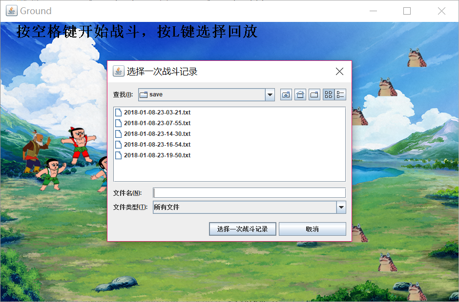

# 葫芦娃大战妖精

**郭雨琦 151220035**


## 实现效果

1. 按下`空格键`之后，正方按`鹤翼`阵型出发；反方以`长蛇`阵型出发。
2. 打斗开始前或者打斗结束后按下`L`可实现读取文件并回放。
3. 当正方全部死亡或反方全部死亡时，游戏结束。


## 游戏界面

进入游戏后界面如下


按下`空格键`后，正方按`冲轭阵`出发；反方以`鹤翼阵`出发


战斗开始前或结束后，可以按‘L’打开文件夹，选择存档，重现场景




## 战斗设定

* 葫芦娃的奔跑速度是其他所有生物的两倍。

* 葫芦娃会寻找附近的敌人，自动向他们靠近。

* 当正反双方相遇时，由上帝决定双方的生死，正方有八成的概率获胜。


## 精彩的战斗

在save文件夹中，存放了几次精彩的战斗场景。


## 封装与继承

`Player`类实现了`Runnable`接口，葫芦娃，爷爷，蝎子精，蛇精，小啰啰均继承自Player。


## 多态

`Field`类中的`ArrayList`均使用泛型实现，体现了多态：

```java
public ArrayList<Player> positiveCreatures;
public ArrayList<Player> negativeCreatures;
public ArrayList<Huluwa> brothers;
public ArrayList<Lackey> lackeys;
```


## 集合与泛型

程序中用到的集合是`ArrayList`，用于储存正方生物，反方生物，葫芦娃，小啰啰，以及所有线程。


## 注解

用`@Override`和`@Test`注解。


## 输入输出

`FileOperation`类中采用的输入输出类有

* `File`：用于获取文件
* `FileReader`与`BufferedReader`：用于读取文件
* `FileWriter`与`BufferedWriter`：用户写入文件


## 单元测试

* 对角色的测试有3个测试方法`testString`、`testLocation`和`testImage()`，分别测试`toString()`、`getX()`、`getY()`、`setX()`、`setY()`、`getImage()`、`setImage()`等方法的正确性。

